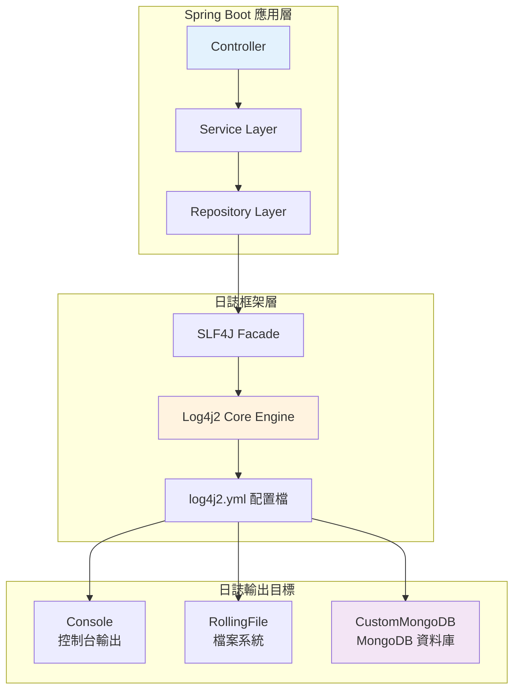
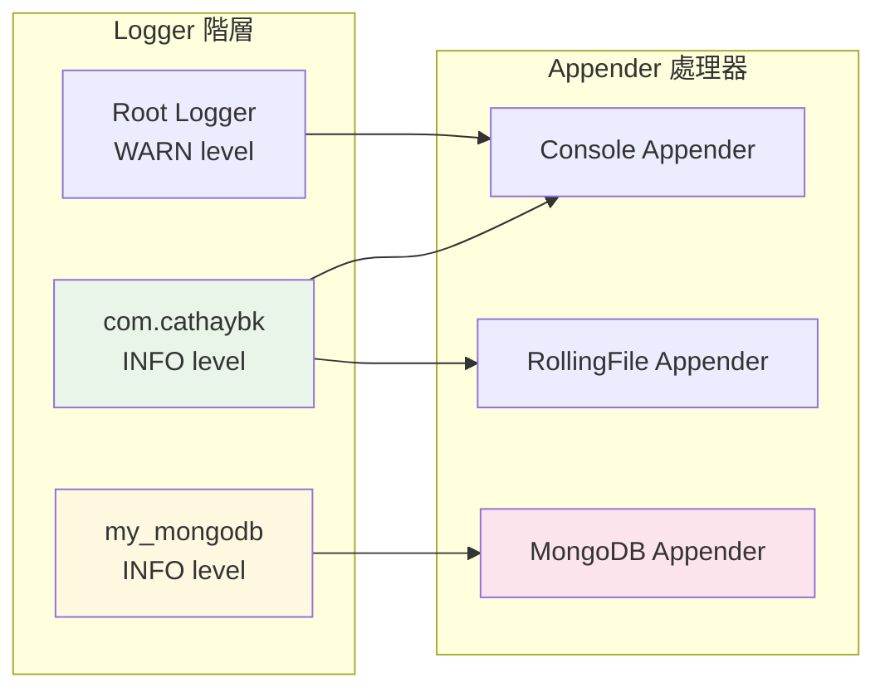
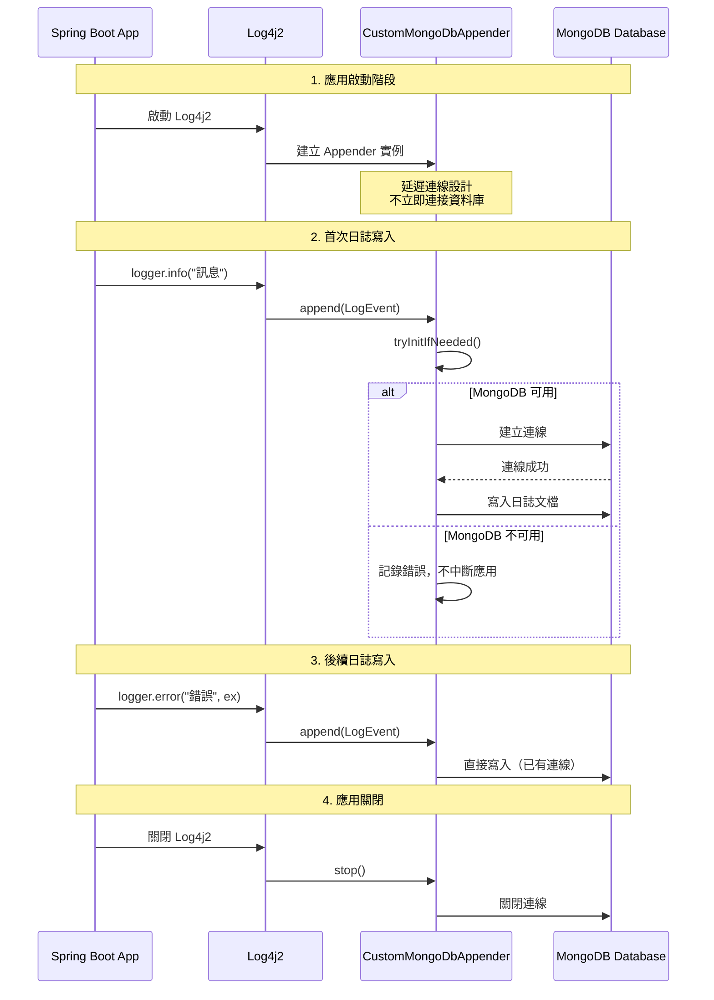
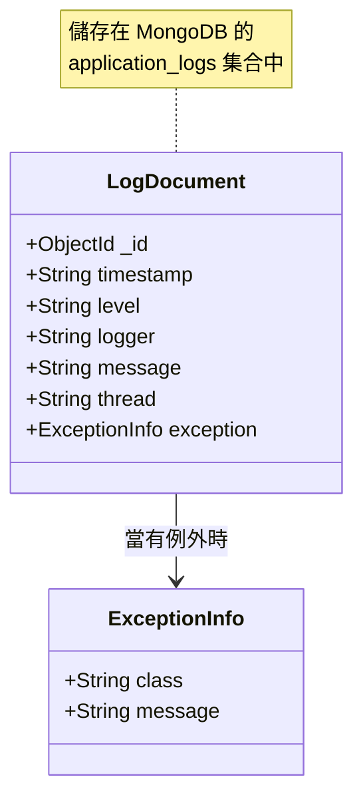

# Log4j2 與 MongoDB 協作行為圖

## 系統架構概覽



## 日誌路由策略



## MongoDB Appender 生命週期



## 日誌資料流向

```mermaid
flowchart TD
    A[業務程式碼<br/>logger.info()] --> B{Log4j2 Logger}
    
    B --> C[Console Appender]
    B --> D[RollingFile Appender] 
    B --> E[MongoDB Appender]
    
    C --> F[控制台輸出<br/>即時顯示]
    D --> G[本地檔案<br/>logs/*.log.gz]
    E --> H[MongoDB 集合<br/>application_logs]
    
    H --> I[結構化查詢<br/>日誌分析<br/>報表生成]
    
    style A fill:#e1f5fe
    style B fill:#fff3e0
    style E fill:#f3e5f5
    style H fill:#e8f5e8
    style I fill:#fce4ec
```

## MongoDB 文檔結構



這些圖表展示了：

1. **系統架構概覽**：Spring Boot 應用如何與 Log4j2 和 MongoDB 協作
2. **日誌路由策略**：不同 Logger 如何分發到不同的 Appender
3. **MongoDB Appender 生命週期**：從啟動到關閉的完整流程
4. **日誌資料流向**：日誌如何從程式碼流向各個輸出目標
5. **MongoDB 文檔結構**：在資料庫中儲存的日誌格式