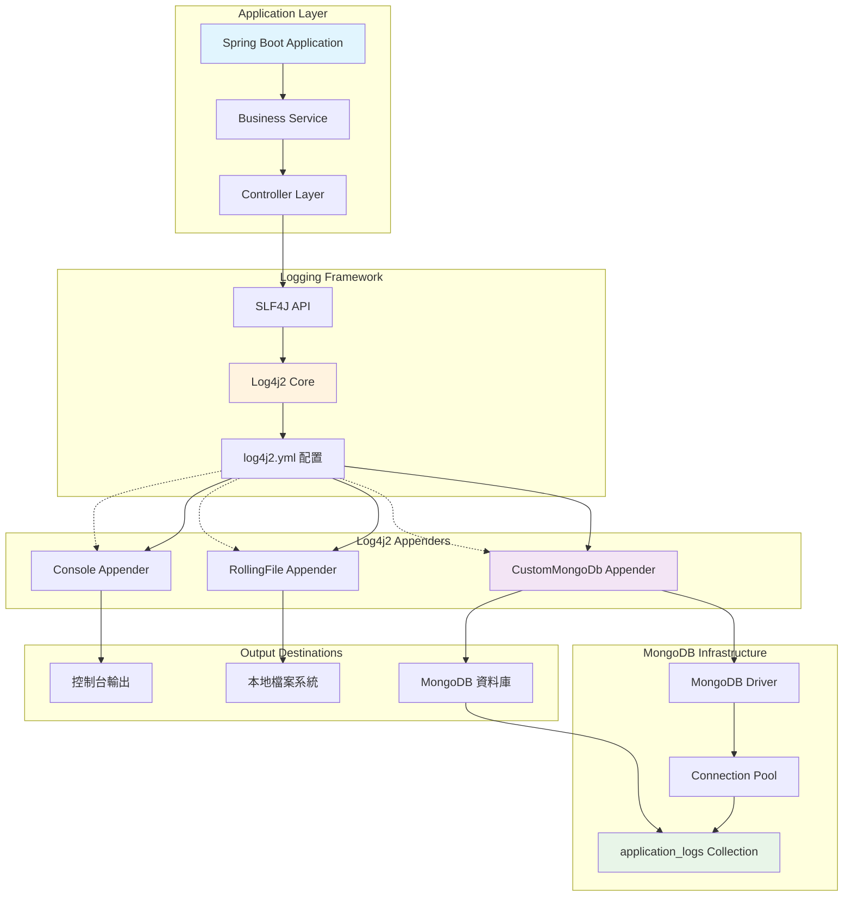
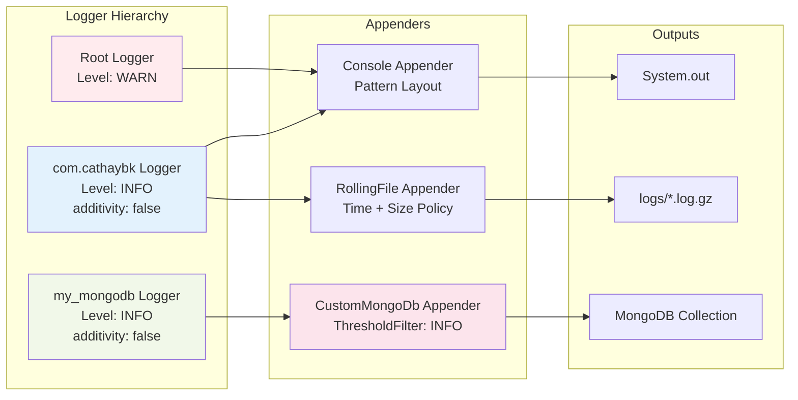
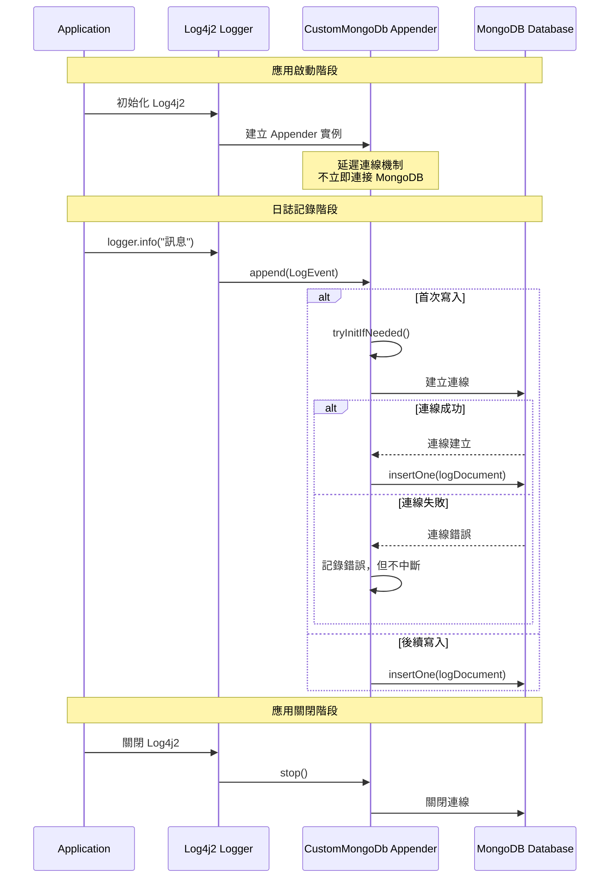

# Log4j2 與 MongoDB 配置說明

## 1. 架構概述

本專案實現了一個完整的 Log4j2 與 MongoDB 整合方案，支持將應用程式日誌同步寫入到 MongoDB 資料庫中。

### 核心組件

1. **Log4j2 核心配置** (`log4j2.yml`)
2. **自訂 MongoDB Appender** (`CustomMongoDbAppender.java`)
3. **Spring Boot 配置** (`application.yml`)
4. **Maven 依賴管理** (`pom.xml`)

## 2. 系統協作流程圖



## 3. Log4j2 配置架構圖



## 4. 詳細配置說明

### 4.1 Maven 依賴 (pom.xml)

```xml
<!-- 排除 Spring Boot 預設的 Logback，使用 Log4j2 -->
<exclusions>
    <exclusion>
        <groupId>org.springframework.boot</groupId>
        <artifactId>spring-boot-starter-logging</artifactId>
    </exclusion>
</exclusions>

<!-- 添加 Log4j2 支援 -->
<dependency>
    <groupId>org.springframework.boot</groupId>
    <artifactId>spring-boot-starter-log4j2</artifactId>
</dependency>

<!-- Log4j2 MongoDB Appender 支援 -->
<dependency>
    <groupId>org.apache.logging.log4j</groupId>
    <artifactId>log4j-mongodb4</artifactId>
    <version>2.20.0</version>
</dependency>

<!-- MongoDB Driver -->
<dependency>
    <groupId>org.mongodb</groupId>
    <artifactId>mongodb-driver-sync</artifactId>
    <version>4.11.1</version>
</dependency>

<!-- 支援 YAML 格式的 Log4j2 配置 -->
<dependency>
    <groupId>com.fasterxml.jackson.dataformat</groupId>
    <artifactId>jackson-dataformat-yaml</artifactId>
</dependency>
```

### 4.2 Log4j2 配置 (log4j2.yml)

#### 全局配置
```yaml
Configuration:
  status: WARN                                    # Log4j2 自身的日誌等級
  monitorInterval: 0                             # 配置檔案監控間隔（0=不監控）
  packages: com.cathaybk.springbootmongodb.config # 自訂組件套件路徑
```

#### 屬性定義
```yaml
Properties:
  Property:
    - name: APP_NAME
      value: "SpringBoot-MongoDB"
    - name: log-path
      value: "logs"
    - name: log-pattern
      value: "[%-5level] %d{yyyy-MM-dd HH:mm:ss.SSS} [%t] %c{1} - [Line:%L] %msg%n"
```

#### Appenders 配置

**1. Console Appender（控制台輸出）**
```yaml
Console:
  name: My_Console_Appender
  target: SYSTEM_OUT
  PatternLayout:
    pattern: ${console-log-pattern}
```

**2. RollingFile Appender（檔案輸出）**
```yaml
RollingFile:
  name: My_RollingFile_Appender
  fileName: "${log-path}/${APP_NAME}.log"
  filePattern: "${log-path}/${APP_NAME}.%d{yyyy-MM-dd HH}-%i.log.gz"
  PatternLayout:
    pattern: "${log-pattern}"
  Policies:
    TimeBasedTriggeringPolicy:
      interval: 1                                # 每小時滾動
    SizeBasedTriggeringPolicy:
      size: "3MB"                               # 檔案大小限制
  DefaultRolloverStrategy:
    max: 3                                      # 保留檔案數量
```

**3. CustomMongoDb Appender（MongoDB 輸出）**
```yaml
CustomMongoDb:
  name: My_MongoDB_Appender
  connectionString: "mongodb://${env:MONGO_DB_USER}:${env:MONGO_DB_PWD}@${env:MONGO_DB_HOST}:${env:MONGO_DB_PORT}/${env:MONGO_DB_INSTANCE_NAME}?authSource=${env:MONGO_DB_AUTH_DB}"
  databaseName: "myshinynewdb"
  collectionName: "application_logs"
  ThresholdFilter:
    level: INFO                                 # 只記錄 INFO 等級以上的日誌
    onMatch: ACCEPT
    onMismatch: DENY
```

## 5. MongoDB Appender 運作流程



## 6. 自訂 MongoDB Appender 特性

### 6.1 延遲連線機制
```java
private void tryInitIfNeeded() {
    // 僅嘗試一次初始化(當 initTried 為 false 時，設為 true 並繼續執行初始化)
    if (!initTried.compareAndSet(false, true)) {
        return;
    }
    
    try {
        mongoClient = MongoClients.create(connectionString);
        MongoDatabase db = mongoClient.getDatabase(databaseName);
        collection = db.getCollection(collectionName);
        LOGGER.info("CustomMongoDbAppender 已連線 MongoDB");
    } catch (Exception e) {
        LOGGER.error("CustomMongoDbAppender 初始化連線失敗: {}", e.getMessage());
        // 不拋出例外，避免影響應用程式運行
    }
}
```

### 6.2 錯誤容忍設計
- MongoDB 連線失敗時不影響應用程式啟動
- 日誌寫入失敗時記錄錯誤但不中斷應用
- 使用 `AtomicBoolean` 確保執行緒安全的初始化

### 6.3 結構化日誌格式
```java
Document logDocument = new Document()
    .append("timestamp", Instant.ofEpochMilli(event.getTimeMillis()).toString())
    .append("level", event.getLevel().toString())
    .append("logger", event.getLoggerName())
    .append("message", event.getMessage().getFormattedMessage())
    .append("thread", event.getThreadName());

if (event.getThrown() != null) {
    Throwable t = event.getThrown();
    logDocument.append("exception", new Document()
        .append("class", t.getClass().getName())
        .append("message", t.getMessage()));
}
```

## 7. 使用方式

### 7.1 一般應用程式日誌
```java
// 使用標準的日誌記錄（會輸出到控制台和檔案）
private static final Logger logger = LoggerFactory.getLogger(MyService.class);

logger.info("這是一般的應用程式日誌");
logger.error("發生錯誤", exception);
```

### 7.2 MongoDB 專用日誌
```java
// 使用專門的 MongoDB Logger（只會寫入 MongoDB）
private static final Logger mongoLogger = LogManager.getLogger("my_mongodb");

mongoLogger.info("這條日誌會寫入 MongoDB");
mongoLogger.warn("重要的業務事件記錄");
```

## 8. MongoDB 日誌格式範例

在 MongoDB 中，日誌會以以下格式儲存：

```json
{
  "_id": ObjectId("..."),
  "timestamp": "2024-01-15T10:30:45.123Z",
  "level": "INFO",
  "logger": "com.cathaybk.service.UserService",
  "message": "使用者登入成功",
  "thread": "http-nio-8080-exec-1",
  "exception": {                          // 僅在有例外時出現
    "class": "java.lang.NullPointerException",
    "message": "參數不能為空"
  }
}
```

## 9. 安全性配置

### 9.1 Jasypt 加密配置
```yaml
# application.yml
jasypt:
  encryptor:
    password: ${JASYPT_ENCRYPTOR_PASSWORD:mySecretKey}
    algorithm: PBEWithMD5AndDES

# 加密的 MongoDB 連線資訊
custom:
  mongodb:
    username: ENC(Hoy4AgRmLJXcHI+UH/XvdLyfj1+jQyYRG1NWFqanpkA=)
    password: ENC(gGt1aiDXi5vLk8OFcRsbOyjfWxET/jzeFnW4AJU5J50=)
    authentication-database: ENC(zv6TdgiR23knlcy5ePxyCKQqmiiW036h)
```

## 10. 優勢與特點

### 10.1 高可用性
- MongoDB 連線失敗時不影響應用程式運行
- 支援延遲連線，避免啟動時的依賴問題

### 10.2 靈活的日誌路由
- 不同的 Logger 可以輸出到不同的目標
- 支援多重輸出（同時輸出到控制台、檔案、MongoDB）

### 10.3 效能考量
- 使用非同步寫入機制（Log4j2 預設）
- 檔案日誌支援滾動壓縮，節省磁碟空間

### 10.4 易於維護
- 集中式的日誌配置管理
- 結構化的日誌格式便於查詢和分析

## 11. 注意事項與最佳實踐

1. **環境變數設定**：確保 MongoDB 連線相關的環境變數已正確設定
2. **網路連線**：MongoDB 連線失敗時，日誌會記錄錯誤但不會中斷應用
3. **效能監控**：大量日誌寫入可能影響 MongoDB 效能，建議適當調整日誌等級
4. **索引優化**：建議在 MongoDB 的 `application_logs` collection 上建立適當的索引

## 12. 故障排除

### 常見問題

1. **CustomMongoDbAppender 找不到**
   - 確認 `log4j2.yml` 中的 `packages` 設定正確
   - 檢查 Java 套件路徑是否匹配

2. **MongoDB 連線失敗**
   - 檢查環境變數設定
   - 確認 MongoDB 服務是否運行
   - 驗證連線字串格式

3. **日誌未寫入 MongoDB**
   - 檢查日誌等級設定
   - 確認 Filter 配置是否正確
   - 查看應用程式啟動日誌中的錯誤訊息